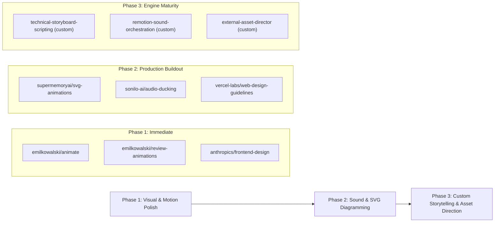

# Skills Ecosystem Evaluation & Recommendations for Technical Story Engine

## Executive Summary

The **Technical Story Engine** is designed to produce localized, high-fidelity technical explainer videos using **Remotion**, **React 19**, and **TypeScript**. Its output quality depends on how effectively coding and creative agents make decisions across seven interlocking domains:

1. **Motion Design & Physics**: Easing curves, spring dynamics, spatial continuity, and timing rhythm.
2. **Technical Diagramming & SVG**: Animated architecture nodes, network packet flows, database state trees, and timing bars.
3. **Sound Design & Audio Orchestration**: Voiceover pacing, background music ducking, and micro-sound effects (SFX).
4. **Visual Hierarchy & Typography**: Contrast ratios, 16:9 YouTube safe zones, and mobile viewport legibility.
5. **Instructional Storytelling & Metaphor Architecture**: Cognitive load management, progressive disclosure, and the 3-step analogy bridge (*Metaphor → Visual Mapping → Technical Model*).
6. **External Asset Direction**: Formulating provider-agnostic asset requirements for illustrations, characters, and generated video clips while adhering to the Human Media Review Gate.
7. **Visual QA & Verification**: Multi-frame inspection, localization text-overflow auditing across `en`, `de`, and `fr`, and frame-budget adherence.

This report evaluates the current skills foundation, identifies capability gaps, reviews curated skills from the open agent skills ecosystem (`skills.sh`), proposes project-tailored custom skills, and provides exact manual installation instructions for the repository maintainer.

---

## 1. Current Baseline Audit

### 1.1 Installed Skills

The project currently has **13 skills** configured in `skills-lock.json` and `.agents/skills/`:

| Skill Name | Origin | Primary Role |
| :--- | :--- | :--- |
| `remotion-best-practices` | `remotion-dev/skills` | Architecture router and high-level Remotion guidance |
| `remotion-markup` | `remotion-dev/skills` | Remotion component APIs, `interpolate`, `spring`, `<Sequence>`, `<Series>` |
| `remotion-captions` | `remotion-dev/skills` | Subtitle handling, word-level timestamps, caption styling |
| `remotion-multimedia` | `remotion-dev/skills` | Audio/video asset integration and Mediabunny APIs |
| `remotion-render` | `remotion-dev/skills` | CLI render flags, codec options, concurrency tuning |
| `remotion-studio` | `remotion-dev/skills` | Remotion preview UI workflows |
| `remotion-docs` | `remotion-dev/skills` | Documentation lookup for Remotion APIs |
| `remotion-create` | `remotion-dev/skills` | Scaffolding new compositions and project setups |
| `remotion-interactivity` | `remotion-dev/skills` | Player interactivity (non-production in this video pipeline) |
| `remotion-maps` | `remotion-dev/skills` | Map animations (not used in current system-design episodes) |
| `remotion-saas` | `remotion-dev/skills` | Cloud render architectures and serverless workflows |
| `remotion-upgrade` | `remotion-dev/skills` | Migration and version upgrade guidance |
| `technical-story-video` | Local Custom | Repository guardrails, scene lifecycle, and handoff contracts |

### 1.2 The Quality Ceiling

The official Remotion skill pack ensures agents write **syntactically valid Remotion code** (avoiding CSS animations in favor of `useCurrentFrame()`, avoiding external state loops, using `staticFile()`).

However, **syntax alone does not create captivating technical video**. When agents rely solely on the Remotion API docs, common visual weaknesses emerge:
- **Robotic, linear motion**: Transitions snap into place or use generic linear interpolations instead of damped harmonic springs.
- **Static architecture diagrams**: Complex systems (such as the Redis cache hit/miss flow in Scenes 08–09) risk looking like static wireframes with basic opacity fades.
- **Audio treated as an afterthought**: Music plays at constant volume without voiceover ducking, and visual actions lack micro-SFX cues.
- **Overcrowded compositions**: Text boxes and architecture nodes drift outside mobile YouTube safe areas.
- **Inconsistent external media requests**: Agents supply vague image prompts rather than clear, separable, transparent vector-style character requirements.

To reach the visual and instructional standard of top-tier educational creators (e.g., *3Blue1Brown*, *Fireship*, *ByteByteGo*, *Veritasium*), agents need specialized guidance in **motion physics**, **diagrammatic animation**, **sound design**, and **visual taste**.

---

## 2. Recommended External Skills from the Open Ecosystem

The following skills are available through the public agent skills directory (`skills.sh`) and can be installed into the project via `npx skills add`.

### Category A: Motion Design & Animation Craft

#### 1. `emilkowalski/skills@animate`
- **Author**: Emil Kowalski
- **Install Command**:
  ```bash
  npx skills add https://github.com/emilkowalski/skills --skill animate --agent codex claude-code antigravity
  ```
- **What it provides**: A battle-tested decision hierarchy for animation:
  1. *Should it animate at all?* (eliminates gratuitous motion that distracts from technical explanation).
  2. *What is the purpose?* (enter, exit, emphasize, state change, causality).
  3. *Which curve and parameters?* (critical damping ratios, mass, stiffness, deceleration curves).
  4. *Interruption and exit behavior*.
- **Why it elevates Technical Story Engine**: Directly improves scenes requiring physical metaphors and data movement (e.g., order tickets sliding across the restaurant counter in Scene 05, timing bars filling dynamically in Scene 02). Prevents mechanical motion.

#### 2. `emilkowalski/skills@review-animations`
- **Author**: Emil Kowalski
- **Install Command**:
  ```bash
  npx skills add https://github.com/emilkowalski/skills --skill review-animations --agent codex claude-code antigravity
  ```
- **What it provides**: A strict, opinionated review checklist for animation code. It flags abrupt starts, linear easing where springs belong, mismatched durations, excessive bounce, and spatial dissonance. Approval must be earned.
- **Why it elevates Technical Story Engine**: Acts as an automated motion-design review gate during task feedback generation, ensuring that every transition in `src/episodes/` meets professional motion standards.

#### 3. `emilkowalski/skills@animation-vocabulary`
- **Author**: Emil Kowalski
- **Install Command**:
  ```bash
  npx skills add https://github.com/emilkowalski/skills --skill animation-vocabulary --agent codex claude-code antigravity
  ```
- **What it provides**: Reverse-lookup glossary translating human descriptions (*"the rubber-band snapback"*, *"the staggered cascade"*, *"the camera zoom-punch"*, *"the layout morph"*) into exact mathematical terms and implementation primitives.
- **Why it elevates Technical Story Engine**: Enables the user and the agent to communicate scene revisions with precision.

---

### Category B: Vector Graphics & SVG Diagramming

#### 4. `supermemoryai/skills@svg-animations`
- **Author**: Supermemory AI
- **Install Command**:
  ```bash
  npx skills add https://github.com/supermemoryai/skills --skill svg-animations --agent codex claude-code antigravity
  ```
- **What it provides**: Comprehensive guide for animated SVG: `stroke-dashoffset` line drawing, path morphing, glowing pulse trails, viewBox normalization, vector masking, and filter effects.
- **Why it elevates Technical Story Engine**: Crucial for architecture scenes (Scenes 04, 07, 08, 09, 10, 14). Allows agents to build clean, animated network packets moving along paths, database cylinder reads/writes, cache hit splits, and server rack indicators without raster artifacts.

#### 5. `anthropics/skills@canvas-design`
- **Author**: Anthropic
- **Install Command**:
  ```bash
  npx skills add https://github.com/anthropics/skills --skill canvas-design --agent codex claude-code antigravity
  ```
- **What it provides**: Techniques for programmatic HTML5 Canvas rendering, generative geometry, particle flows, math-driven visual systems, and clean composition layouts.
- **Why it elevates Technical Story Engine**: When dozens of concurrent requests or memory cells must be visualized (such as Scene 10 *Why Redis Can Be Fast* or Scene 13 *Cache Tradeoffs*), rendering via HTML Canvas inside a Remotion frame avoids DOM bloat while keeping renders crisp and fast.

---

### Category C: Visual Hierarchy, Design Systems & React 19 Architecture

#### 6. `anthropics/skills@frontend-design`
- **Author**: Anthropic
- **Install Command**:
  ```bash
  npx skills add https://github.com/anthropics/skills --skill frontend-design --agent codex claude-code antigravity
  ```
- **What it provides**: Aesthetic direction for typography hierarchy, whitespace, balance, purposeful color usage, and crafting distinct visual themes that avoid generic template looks.
- **Why it elevates Technical Story Engine**: Keeps typography and architecture node treatments visually distinct. Supports the rules defined in `docs/visual-system.md` by enforcing disciplined contrast ratios, clean node badges, and clear focal points.

#### 7. `vercel-labs/agent-skills@web-design-guidelines`
- **Author**: Vercel Labs
- **Install Command**:
  ```bash
  npx skills add https://github.com/vercel-labs/agent-skills --skill web-design-guidelines --agent codex claude-code antigravity
  ```
- **What it provides**: Comprehensive interface guidelines: contrast ratios, typographic scales, visual spacing rules, and layout balance.
- **Why it elevates Technical Story Engine**: Enforces YouTube mobile legibility standards. Prevents secondary text from falling below readable threshold sizes and validates safe margins (120 px horizontal, 90 px vertical).

#### 8. `vercel-labs/agent-skills@vercel-composition-patterns`
- **Author**: Vercel Labs
- **Install Command**:
  ```bash
  npx skills add https://github.com/vercel-labs/agent-skills --skill vercel-composition-patterns --agent codex claude-code antigravity
  ```
- **What it provides**: Advanced React 19 component composition patterns (compound components, render props, slot patterns, avoiding boolean prop proliferation).
- **Why it elevates Technical Story Engine**: The repository uses **React 19.3.0**. As shared scene components (like `TimingBar.tsx` and future architecture node components) grow, clean compound composition patterns keep them reusable and maintainable.

---

### Category D: Audio Engineering & Sound Design

#### 9. `sonilo-ai/skills@audio-ducking`
- **Author**: Sonilo AI
- **Install Command**:
  ```bash
  npx skills add https://github.com/sonilo-ai/skills --skill audio-ducking --agent codex claude-code antigravity
  ```
- **What it provides**: Sound design principles for automatic audio ducking—attenuating background music beds under voice narration and restoring volume during pauses.
- **Why it elevates Technical Story Engine**: The engine produces multi-language dubbed videos (`en`, `de`, `fr`). When narration is introduced, background music must duck dynamically behind speech tracks. This skill provides the formulas and volume envelope logic needed for Remotion's `<Audio>` components.

---

## 3. Recommended Project-Custom Skills

In addition to external skills, the engine has specific architectural patterns that general skills cannot know. Adding targeted internal skills into `.agents/skills/` (and synchronizing via `scripts/sync-agent-skills.ps1`) will immediately improve agent performance.

```
.agents/skills/
├── technical-story-video/          (Existing foundational skill)
├── technical-storyboard-scripting/ (NEW: Explainer narrative & pedagogical pacing)
├── remotion-sound-orchestration/   (NEW: Audio layering, ducking formulas, SFX cues)
├── external-asset-director/        (NEW: Character sheets & asset prompt specifications)
└── visual-qa-audit/                (NEW: Safe-zone, frame budget & localization QA)
```

### Proposed Custom Skill 1: `technical-storyboard-scripting`
- **Purpose**: Guides agents in converting raw technical documentation into clear, engaging visual storyboards.
- **Key Concepts Encoded**:
  - **The 3-Step Analogy Bridge**: *Real-World Metaphor* (e.g. restaurant kitchen) → *Explicit Spatial Mapping* (Chef = Database, Cashier = App, Shelf = Redis) → *Technical Reality* (RAM vs disk, query latency, TTL).
  - **Cognitive Load Theory**: One focal idea per scene. Never introduce a new visual element and a new technical term on the exact same frame.
  - **Dual Coding**: Spoken words and on-screen visuals must reinforce, not duplicate, each other (narration explains the "why", visuals show the "how").
  - **Pacing Budgets**: Target word count per second (130–150 words/minute for English, adjusting for 15–20% expansion in German/French).

### Proposed Custom Skill 2: `remotion-sound-orchestration`
- **Purpose**: Establishes standard Remotion audio architecture for multi-track sound design.
- **Key Concepts Encoded**:
  - **Layer Hierarchy**: Voiceover Track (0 dB target, normalized to -14 LUFS) → Sound Effects Track (-6 dB to -12 dB) → Ambient Music Bed (-18 dB to -24 dB when ducked).
  - **Dynamic Ducking Formula in Remotion**: Calculating volume keyframes in `useCurrentFrame()` using `interpolate()` based on speech activity windows.
  - **SFX Cue Mapping**: Audio micro-cues tied to visual state changes (e.g., subtle pop on node entrance, whoosh on packet transmission, chime on cache HIT, low thud on cache MISS).

### Proposed Custom Skill 3: `external-asset-director`
- **Purpose**: Standardizes the formulation of **External Asset Requests** for generative image/video providers (Midjourney, Flux, Recraft, Runway) in accordance with `docs/agent-workflow.md`.
- **Key Concepts Encoded**:
  - **Style Consistency**: Flat/isometric clean vector illustration, consistent character anatomy across scenes (Chef, Cashier, Alice, Developer).
  - **Separation Principle**: Characters and props must have transparent backgrounds (`.png` / `.webp`) so they can be layered independently.
  - **Label Gating**: Generated media must never contain baked-in text; all titles, badges, and numbers must be rendered by Remotion to preserve multi-language support.

### Proposed Custom Skill 4: `visual-qa-audit`
- **Purpose**: Provides a structured inspection protocol for validating rendered frames and candidate videos.
- **Key Concepts Encoded**:
  - **Safe Margin Verification**: 120 px horizontal, 90 px vertical margins; bottom 64 px reserved for player controls/captions.
  - **Multi-Language Expansion Check**: Verifying that German/French copy does not break containers or cause awkward line wraps.
  - **Mobile 360p Readability Check**: Ensuring hero metrics and node titles remain legible when scaled down.
  - **Focal Point Audit**: Checking that visual contrast guides the viewer's eye to the active explanation beat.

---

## 4. Skills Ecosystem Comparison Matrix

| Skill | Category | Source | Impact on Video Output | Effort to Install |
| :--- | :--- | :--- | :--- | :--- |
| **`emilkowalski/skills@animate`** | Motion Design | `skills.sh` | **Highest** (natural physics, fluid transitions) | Low (CLI) |
| **`emilkowalski/skills@review-animations`** | QA / Polish | `skills.sh` | **High** (prevents stiff/robotic transitions) | Low (CLI) |
| **`supermemoryai/skills@svg-animations`** | Visuals | `skills.sh` | **Highest** (animated packets, buses, nodes) | Low (CLI) |
| **`anthropics/skills@frontend-design`** | Design System | `skills.sh` | **High** (visual hierarchy, contrast, layout) | Low (CLI) |
| **`vercel-labs/agent-skills@web-design-guidelines`** | Layout / QA | `skills.sh` | **Medium** (safe margins, mobile legibility) | Low (CLI) |
| **`sonilo-ai/skills@audio-ducking`** | Sound Design | `skills.sh` | **High** (clean voiceover & music balance) | Low (CLI) |
| **`technical-storyboard-scripting`** | Story / Script | Internal | **Highest** (pacing, clarity, cognitive load) | Medium (Repo doc) |
| **`remotion-sound-orchestration`** | Audio in Remotion | Internal | **High** (multi-track SFX and ducking) | Medium (Repo doc) |
| **`external-asset-director`** | Asset Pipeline | Internal | **High** (character consistency, transparency) | Medium (Repo doc) |
| **`visual-qa-audit`** | Quality Gate | Internal | **Medium** (thorough frame inspection) | Medium (Repo doc) |

---

## 5. Manual Installation & Setup Instructions

Because you prefer to review and install skills manually, follow the step-by-step procedures below.

### Step 1: Install Selected External Skills via `npx skills`

Run the following commands in your terminal from the repository root (`D:\my works\video-lab\technical-story-engine`):

#### Recommended Bundle 1: Animation & Motion Polish (High Priority)
```powershell
npx skills add https://github.com/emilkowalski/skills --skill animate review-animations animation-vocabulary --agent codex claude-code antigravity -y
```

#### Recommended Bundle 2: SVG & Visual Design (High Priority)
```powershell
npx skills add https://github.com/supermemoryai/skills --skill svg-animations --agent codex claude-code antigravity -y
npx skills add https://github.com/anthropics/skills --skill frontend-design --agent codex claude-code antigravity -y
npx skills add https://github.com/vercel-labs/agent-skills --skill web-design-guidelines vercel-composition-patterns --agent codex claude-code antigravity -y
```

#### Recommended Bundle 3: Audio & Sound Principles (Medium Priority)
```powershell
npx skills add https://github.com/sonilo-ai/skills --skill audio-ducking --agent codex claude-code antigravity -y
```

### Step 2: Verify `skills-lock.json`

After running the install commands, `skills-lock.json` will be automatically updated with the new skill sources, paths, and SHA-256 hashes. Verify that the file remains clean:
```powershell
git status
```

### Step 3: Synchronize Agent Discovery Links

For Claude Code and local agents, ensure discovery links are updated:
```powershell
powershell.exe -NoProfile -ExecutionPolicy Bypass -File scripts/sync-agent-skills.ps1
```

### Step 4: Verify Installed Skills List

Confirm all skills are recognized by the CLI:
```powershell
npx skills list
```

---

## 6. Recommended Rollout Plan

To avoid cognitive overload for both the development team and the coding agents, adopt a three-phase rollout:



### Phase 1: Visual & Motion Polish (Immediate)
- **Goal**: Elevate Scenes 01–04 transitions from standard interpolation to natural spring dynamics and polished visual hierarchy.
- **Skills to install**: `animate`, `review-animations`, `frontend-design`.

### Phase 2: SVG Diagramming & Audio Design (Scenes 05–10)
- **Goal**: Enable animated SVG network packets and database interactions, and prepare the engine for narration and music beds.
- **Skills to install**: `svg-animations`, `audio-ducking`, `web-design-guidelines`.

### Phase 3: Custom Explainer Engine Skills (Scenes 11–14 & Future Episodes)
- **Goal**: Codify the studio's storytelling philosophy, character asset direction, and visual QA directly into version-controlled internal skills.
- **Deliverables**: Create `technical-storyboard-scripting`, `remotion-sound-orchestration`, and `external-asset-director` in `.agents/skills/`.

---

## 7. Architectural Alignment & Guardrails

When installing new skills, remember the foundational rules established in `AGENTS.md` and `docs/production-architecture.md`:

1. **Remotion is the Permanent Core**: Skills must guide agents to build inside React, Remotion, and TypeScript. Skills that recommend runtime third-party players or incompatible animation libraries must not override Remotion's frame-based architecture.
2. **Provider Independence**: External asset skills (for audio, images, or video) must only assist in creating candidate assets or drafting requirements. They must never introduce proprietary runtime SDKs into `src/`.
3. **Human Media Review Gate**: Regardless of which skills are installed, all rendered media (`.png`, `.mp4`, `.wav`) remains in the `candidate` state until explicitly approved by the human reviewer.
4. **Token Economy**: Avoid installing dozens of speculative skills. The curated list above focuses strictly on high-signal skills that directly enhance explainer video quality.
